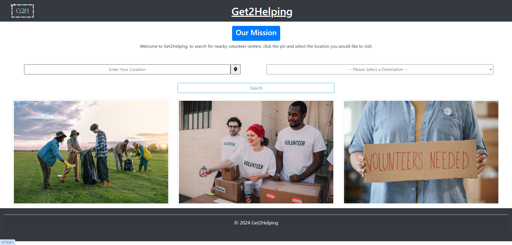
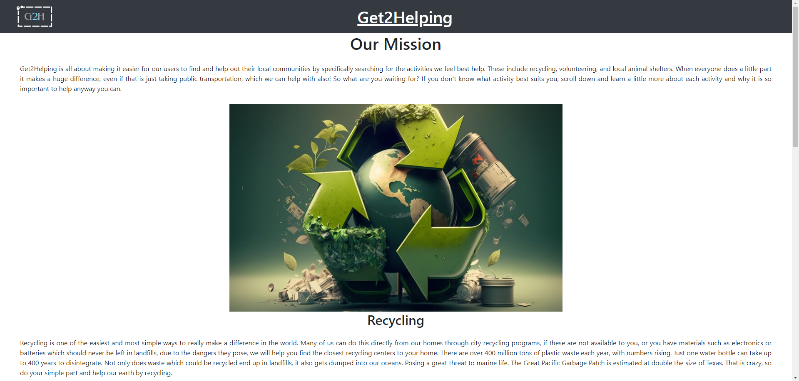
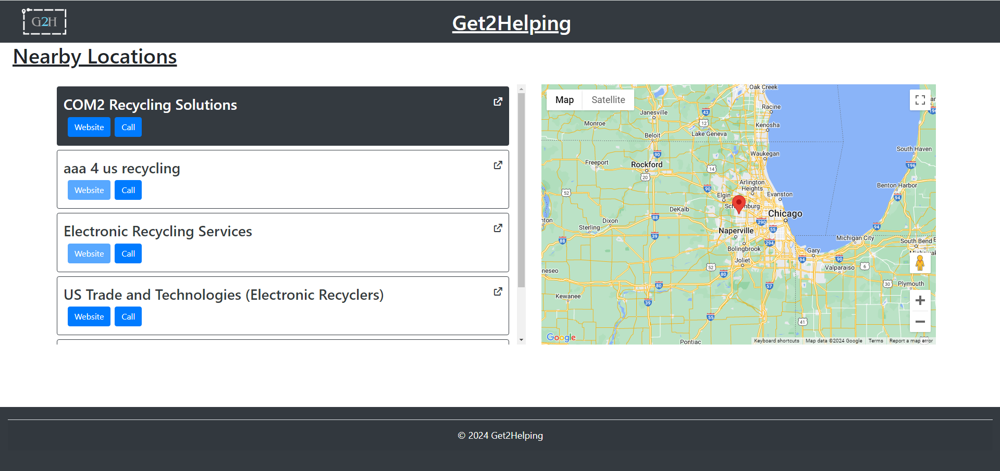

# Software Systems Capstone - CPSC-49200-004
___
Built for the May 2024 Capstone course at Lewis University.

## Get2Helping
___
During the first few weeks of the course, we were tasked with creating a mockup of a website aimed at helping the community in some way.

Our group proposed an app that could serve multiple communities instead of just one. We decided on a website that locates the nearest of three options based on the user's location and a defined distance:
- Recycling Centers
- Volunteer Locations
- Animal Adoption Centers

The main goal of this project is to demonstrate our knowledge of GIT, Flask, Python, and CSS.

## Requirements
___
**_You are required to apply your Google API key for Places and Maps_**

| Library                | Version  |
|------------------------|----------|
| Flask                  | 3.0.2    |
| flask_wtf              | 1.2.1    |
| python-dotenv          | 1.0.1    |
| WTForms                | 3.1.2    |
| python-google-places   | 1.4.2    |

## Pages
___

### **Home Page:**
[View the Home Page Code](https://github.com/abahr35/Get2Helping/blob/main/templates/home.html)

The landing page allows users to input their location and choose a destination type (Recycling Center, Volunteer Location, or Animal Adoption Center).

### **About Page:**
[View the About Page Code](https://github.com/abahr35/Get2Helping/blob/main/templates/about.html)  

The about page shows our mission statement and how the locations we provide impact everyday people.

### **Resulting Maps Page:**
[View the Resulting Maps Code](https://github.com/abahr35/Get2Helping/blob/main/templates/about.html)  

This page returns the output of locations based on the user's location and generates a path for them to take using Google Maps.